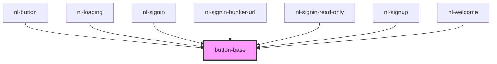

# button-base

<!-- Auto Generated Below -->

## Properties

| Property   | Attribute   | Description | Type                                             | Default        |
| ---------- | ----------- | ----------- | ------------------------------------------------ | -------------- |
| `disabled` | `disabled`  |             | `boolean`                                        | `false`        |
| `nlTheme`  | `nl-theme`  |             | `"default" \| "lemonade" \| "ocean" \| "purple"` | `'default'`    |
| `titleBtn` | `title-btn` |             | `string`                                         | `'Open modal'` |

## Dependencies

### Used by

 - [nl-button](../nl-button)
 - [nl-loading](../nl-loading)
 - [nl-signin](../nl-signin)
 - [nl-signin-bunker-url](../nl-signin-bunker-url)
 - [nl-signin-read-only](../nl-signin-read-only)
 - [nl-signup](../nl-signup)
 - [nl-welcome](../nl-welcome)

### Graph

----------------------------------------------

*Built with [StencilJS](https://stenciljs.com/)*
