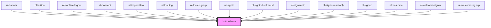

# button-base

<!-- Auto Generated Below -->

## Properties

| Property   | Attribute   | Description | Type                                                       | Default        |
| ---------- | ----------- | ----------- | ---------------------------------------------------------- | -------------- |
| `darkMode` | `dark-mode` |             | `boolean`                                                  | `false`        |
| `disabled` | `disabled`  |             | `boolean`                                                  | `false`        |
| `theme`    | `theme`     |             | `"crab" \| "default" \| "lemonade" \| "ocean" \| "purple"` | `'default'`    |
| `titleBtn` | `title-btn` |             | `string`                                                   | `'Open modal'` |

## Dependencies

### Used by

 - [nl-banner](../nl-banner)
 - [nl-button](../nl-button)
 - [nl-confirm-logout](../nl-confirm-logout)
 - [nl-connect](../nl-connect)
 - [nl-import-flow](../nl-import-flow)
 - [nl-loading](../nl-loading)
 - [nl-local-signup](../nl-local-signup)
 - [nl-signin](../nl-signin)
 - [nl-signin-bunker-url](../nl-signin-bunker-url)
 - [nl-signin-otp](../nl-signin-otp)
 - [nl-signin-read-only](../nl-signin-read-only)
 - [nl-signup](../nl-signup)
 - [nl-welcome](../nl-welcome)
 - [nl-welcome-signin](../nl-welcome-signin)
 - [nl-welcome-signup](../nl-welcome-signup)

### Graph

----------------------------------------------

*Built with [StencilJS](https://stenciljs.com/)*
