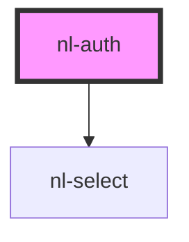

# nl-auth

<!-- Auto Generated Below -->

## Properties

| Property      | Attribute      | Description | Type                                             | Default                  |
| ------------- | -------------- | ----------- | ------------------------------------------------ | ------------------------ |
| `startScreen` | `start-screen` |             | `string`                                         | `CURRENT_MODULE.WELCOME` |
| `theme`       | `theme`        |             | `"default" \| "lemonade" \| "ocean" \| "purple"` | `'default'`              |

## Events

| Event           | Description | Type                  |
| --------------- | ----------- | --------------------- |
| `nlCheckLogin`  |             | `CustomEvent<string>` |
| `nlCheckSignup` |             | `CustomEvent<string>` |
| `nlCloseModal`  |             | `CustomEvent<any>`    |
| `nlLogin`       |             | `CustomEvent<string>` |
| `nlSignup`      |             | `CustomEvent<string>` |

## Dependencies

### Depends on

- [nl-select](../nl-select)

### Graph

----------------------------------------------

*Built with [StencilJS](https://stenciljs.com/)*
