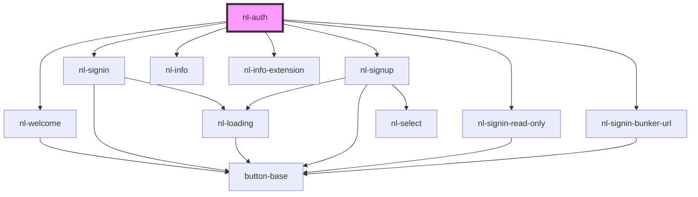

# nl-auth

<!-- Auto Generated Below -->

## Properties

| Property                | Attribute                   | Description | Type                                             | Default                  |
| ----------------------- | --------------------------- | ----------- | ------------------------------------------------ | ------------------------ |
| `isSignInWithExtension` | `is-sign-in-with-extension` |             | `boolean`                                        | `true`                   |
| `startScreen`           | `start-screen`              |             | `string`                                         | `CURRENT_MODULE.WELCOME` |
| `theme`                 | `theme`                     |             | `"default" \| "lemonade" \| "ocean" \| "purple"` | `'default'`              |

## Events

| Event                     | Description | Type                  |
| ------------------------- | ----------- | --------------------- |
| `handleChangeDarkMode`    |             | `CustomEvent<string>` |
| `handleRemoveWindowNostr` |             | `CustomEvent<string>` |
| `nlCloseModal`            |             | `CustomEvent<any>`    |

## Dependencies

### Depends on

- [nl-welcome](../nl-welcome)
- [nl-signin](../nl-signin)
- [nl-signup](../nl-signup)
- [nl-info](../nl-info)
- [nl-info-extension](../nl-info-extension)
- [nl-signin-read-only](../nl-signin-read-only)
- [nl-signin-bunker-url](../nl-signin-bunker-url)

### Graph

----------------------------------------------

*Built with [StencilJS](https://stenciljs.com/)*
