# nl-auth

<!-- Auto Generated Below -->

## Properties

| Property             | Attribute              | Description | Type                                                       | Default                  |
| -------------------- | ---------------------- | ----------- | ---------------------------------------------------------- | ------------------------ |
| `accounts`           | --                     |             | `Info[]`                                                   | `[]`                     |
| `authMethods`        | --                     |             | `AuthMethod[]`                                             | `[]`                     |
| `authUrl`            | `auth-url`             |             | `string`                                                   | `''`                     |
| `bunkers`            | `bunkers`              |             | `string`                                                   | `''`                     |
| `darkMode`           | `dark-mode`            |             | `boolean`                                                  | `false`                  |
| `error`              | `error`                |             | `string`                                                   | `''`                     |
| `hasExtension`       | `has-extension`        |             | `boolean`                                                  | `false`                  |
| `hasOTP`             | `has-o-t-p`            |             | `boolean`                                                  | `false`                  |
| `isLoading`          | `is-loading`           |             | `boolean`                                                  | `false`                  |
| `isLoadingExtension` | `is-loading-extension` |             | `boolean`                                                  | `false`                  |
| `isOTP`              | `is-o-t-p`             |             | `boolean`                                                  | `false`                  |
| `localSignup`        | `local-signup`         |             | `boolean`                                                  | `false`                  |
| `recents`            | --                     |             | `RecentType[]`                                             | `[]`                     |
| `startScreen`        | `start-screen`         |             | `string`                                                   | `CURRENT_MODULE.WELCOME` |
| `theme`              | `theme`                |             | `"crab" \| "default" \| "lemonade" \| "ocean" \| "purple"` | `'default'`              |
| `welcomeDescription` | `welcome-description`  |             | `string`                                                   | `''`                     |
| `welcomeTitle`       | `welcome-title`        |             | `string`                                                   | `''`                     |

## Events

| Event              | Description | Type                   |
| ------------------ | ----------- | ---------------------- |
| `nlChangeDarkMode` |             | `CustomEvent<boolean>` |
| `nlCloseModal`     |             | `CustomEvent<any>`     |

## Dependencies

### Depends on

- [nl-signin-otp](../nl-signin-otp)
- [nl-welcome](../nl-welcome)
- [nl-signin](../nl-signin)
- [nl-signup](../nl-signup)
- [nl-local-signup](../nl-local-signup)
- [nl-confirm-logout](../nl-confirm-logout)
- [nl-import-flow](../nl-import-flow)
- [nl-info](../nl-info)
- [nl-info-extension](../nl-info-extension)
- [nl-signin-read-only](../nl-signin-read-only)
- [nl-signin-bunker-url](../nl-signin-bunker-url)
- [nl-welcome-signin](../nl-welcome-signin)
- [nl-welcome-signup](../nl-welcome-signup)
- [nl-signin-connection-string](../nl-signin-connection-string)
- [nl-connect](../nl-connect)
- [nl-previously-logged](../nl-previously-logged)
- [nl-loading](../nl-loading)

### Graph

```mermaid
graph TD;
  nl-auth --> nl-signin-otp
  nl-auth --> nl-welcome
  nl-auth --> nl-signin
  nl-auth --> nl-signup
  nl-auth --> nl-local-signup
  nl-auth --> nl-confirm-logout
  nl-auth --> nl-import-flow
  nl-auth --> nl-info
  nl-auth --> nl-info-extension
  nl-auth --> nl-signin-read-only
  nl-auth --> nl-signin-bunker-url
  nl-auth --> nl-welcome-signin
  nl-auth --> nl-welcome-signup
  nl-auth --> nl-signin-connection-string
  nl-auth --> nl-connect
  nl-auth --> nl-previously-logged
  nl-auth --> nl-loading
  nl-signin-otp --> button-base
  nl-welcome --> button-base
  nl-signin --> button-base
  nl-signup --> nl-select
  nl-signup --> button-base
  nl-local-signup --> button-base
  nl-confirm-logout --> button-base
  nl-import-flow --> button-base
  nl-import-flow --> nl-select
  nl-signin-read-only --> button-base
  nl-signin-bunker-url --> button-base
  nl-welcome-signin --> button-base
  nl-welcome-signup --> button-base
  nl-connect --> button-base
  nl-previously-logged --> nl-login-status
  nl-loading --> button-base
  style nl-auth fill:#f9f,stroke:#333,stroke-width:4px
```

----------------------------------------------

*Built with [StencilJS](https://stenciljs.com/)*
