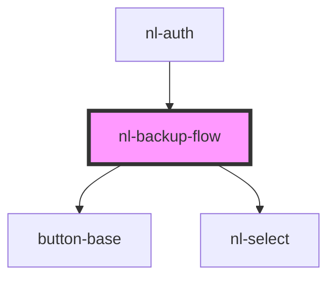

# nl-backup-flow

<!-- Auto Generated Below -->

## Properties

| Property      | Attribute      | Description | Type     | Default                      |
| ------------- | -------------- | ----------- | -------- | ---------------------------- |
| `bunkers`     | `bunkers`      |             | `string` | `'nsec.app,highlighter.com'` |
| `description` | `description`  |             | `string` | `'some text'`                |
| `titleSignup` | `title-signup` |             | `string` | `'Backup an account'`        |

## Events

| Event          | Description | Type                   |
| -------------- | ----------- | ---------------------- |
| `fetchHandler` |             | `CustomEvent<boolean>` |
| `nlSignup`     |             | `CustomEvent<string>`  |

## Dependencies

### Used by

 - [nl-auth](../nl-auth)

### Depends on

- [button-base](../button-base)
- [nl-select](../nl-select)

### Graph

----------------------------------------------

*Built with [StencilJS](https://stenciljs.com/)*
