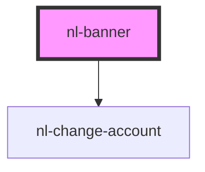

# nl-banner

<!-- Auto Generated Below -->

## Properties

| Property       | Attribute      | Description | Type                                                              | Default     |
| -------------- | -------------- | ----------- | ----------------------------------------------------------------- | ----------- |
| `accounts`     | --             |             | `Info[]`                                                          | `[]`        |
| `isLoading`    | `is-loading`   |             | `boolean`                                                         | `false`     |
| `isOpen`       | `is-open`      |             | `boolean`                                                         | `false`     |
| `listNotifies` | --             |             | `string[]`                                                        | `[]`        |
| `nlTheme`      | `nl-theme`     |             | `"default" \| "lemonade" \| "ocean" \| "purple"`                  | `'default'` |
| `notify`       | --             |             | `{ confirm: number; url?: string; timeOut?: { link: string; }; }` | `null`      |
| `titleBanner`  | `title-banner` |             | `string`                                                          | `''`        |
| `userInfo`     | --             |             | `Info`                                                            | `null`      |

## Events

| Event                       | Description | Type                  |
| --------------------------- | ----------- | --------------------- |
| `handleLoginBanner`         |             | `CustomEvent<string>` |
| `handleLogoutBanner`        |             | `CustomEvent<string>` |
| `handleNotifyConfirmBanner` |             | `CustomEvent<string>` |
| `handleOpenWelcomeModal`    |             | `CustomEvent<string>` |
| `handleRetryConfirmBanner`  |             | `CustomEvent<string>` |
| `handleSetConfirmBanner`    |             | `CustomEvent<string>` |

## Dependencies

### Depends on

- [nl-change-account](../nl-change-account)

### Graph

----------------------------------------------

*Built with [StencilJS](https://stenciljs.com/)*
