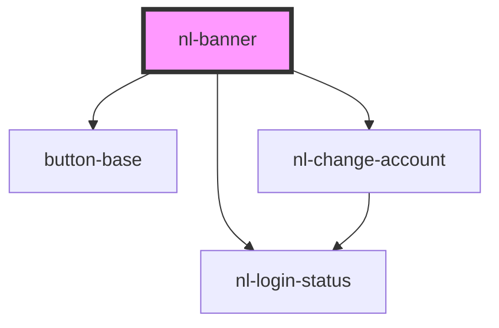

# nl-banner

<!-- Auto Generated Below -->

## Properties

| Property      | Attribute      | Description | Type                                                                                  | Default     |
| ------------- | -------------- | ----------- | ------------------------------------------------------------------------------------- | ----------- |
| `accounts`    | --             |             | `Info[]`                                                                              | `[]`        |
| `darkMode`    | `dark-mode`    |             | `boolean`                                                                             | `false`     |
| `hiddenMode`  | `hidden-mode`  |             | `boolean`                                                                             | `false`     |
| `isLoading`   | `is-loading`   |             | `boolean`                                                                             | `false`     |
| `isOpen`      | `is-open`      |             | `boolean`                                                                             | `false`     |
| `notify`      | --             |             | `{ confirm: number; url?: string; iframeUrl?: string; timeOut?: { link: string; }; }` | `null`      |
| `theme`       | `theme`        |             | `"crab" \| "default" \| "lemonade" \| "ocean" \| "purple"`                            | `'default'` |
| `titleBanner` | `title-banner` |             | `string`                                                                              | `''`        |
| `userInfo`    | --             |             | `Info`                                                                                | `null`      |

## Events

| Event                       | Description | Type                  |
| --------------------------- | ----------- | --------------------- |
| `handleConfirmLogout`       |             | `CustomEvent<string>` |
| `handleImportModal`         |             | `CustomEvent<string>` |
| `handleLoginBanner`         |             | `CustomEvent<string>` |
| `handleLogoutBanner`        |             | `CustomEvent<string>` |
| `handleNotifyConfirmBanner` |             | `CustomEvent<string>` |
| `handleOpenWelcomeModal`    |             | `CustomEvent<string>` |

## Dependencies

### Depends on

- [nl-login-status](../nl-login-status)
- [button-base](../button-base)
- [nl-change-account](../nl-change-account)

### Graph

----------------------------------------------

*Built with [StencilJS](https://stenciljs.com/)*
