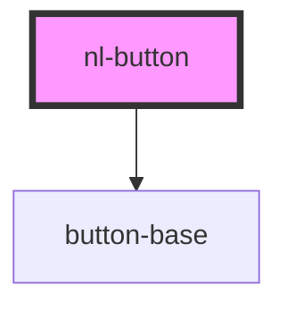

# nl-button

<!-- Auto Generated Below -->

## Properties

| Property   | Attribute   | Description | Type                                             | Default        |
| ---------- | ----------- | ----------- | ------------------------------------------------ | -------------- |
| `darkMode` | `dark-mode` |             | `boolean`                                        | `false`        |
| `disabled` | `disabled`  |             | `boolean`                                        | `false`        |
| `theme`    | `theme`     |             | `"default" \| "lemonade" \| "ocean" \| "purple"` | `'default'`    |
| `titleBtn` | `title-btn` |             | `string`                                         | `'Open modal'` |

## Dependencies

### Depends on

- [button-base](../button-base)

### Graph

----------------------------------------------

*Built with [StencilJS](https://stenciljs.com/)*
