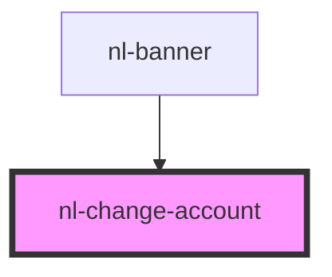

# nl-change-account

<!-- Auto Generated Below -->

## Properties

| Property         | Attribute         | Description | Type                                             | Default     |
| ---------------- | ----------------- | ----------- | ------------------------------------------------ | ----------- |
| `accounts`       | --                |             | `Info[]`                                         | `[]`        |
| `currentAccount` | `current-account` |             | `string`                                         | `''`        |
| `darkMode`       | `dark-mode`       |             | `boolean`                                        | `false`     |
| `theme`          | `theme`           |             | `"default" \| "lemonade" \| "ocean" \| "purple"` | `'default'` |

## Events

| Event                    | Description | Type                  |
| ------------------------ | ----------- | --------------------- |
| `handleOpenWelcomeModal` |             | `CustomEvent<string>` |
| `handleSwitchAccount`    |             | `CustomEvent<Info>`   |

## Dependencies

### Used by

 - [nl-banner](../nl-banner)

### Graph

----------------------------------------------

*Built with [StencilJS](https://stenciljs.com/)*
