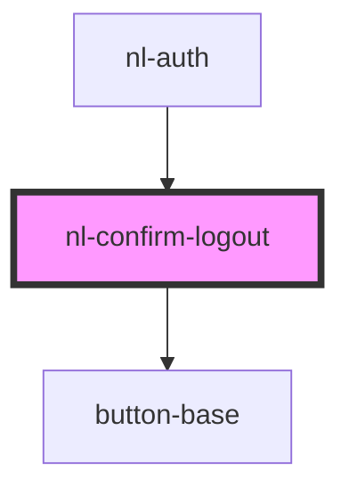

# nl-confirm-logout

<!-- Auto Generated Below -->

## Properties

| Property      | Attribute     | Description | Type     | Default                                                                                                                         |
| ------------- | ------------- | ----------- | -------- | ------------------------------------------------------------------------------------------------------------------------------- |
| `description` | `description` |             | `string` | `"Your account keys are stored in this browser tab and will be deleted if you log out, and your account will be inaccessible."` |
| `titleModal`  | `title-modal` |             | `string` | `"Delete keys?"`                                                                                                                |

## Events

| Event                | Description | Type                  |
| -------------------- | ----------- | --------------------- |
| `handleBackUpModal`  |             | `CustomEvent<string>` |
| `handleLogoutBanner` |             | `CustomEvent<string>` |
| `nlCloseModal`       |             | `CustomEvent<any>`    |

## Dependencies

### Used by

 - [nl-auth](../nl-auth)

### Depends on

- [button-base](../button-base)

### Graph

----------------------------------------------

*Built with [StencilJS](https://stenciljs.com/)*
