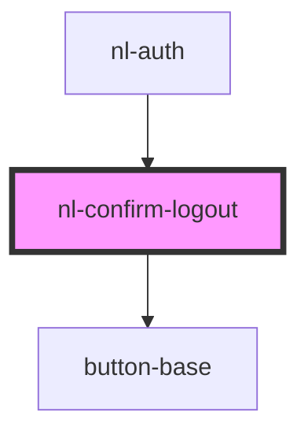

# nl-confirm-logout

<!-- Auto Generated Below -->

## Events

| Event                | Description | Type                   |
| -------------------- | ----------- | ---------------------- |
| `handleBackUpModal`  |             | `CustomEvent<string>`  |
| `handleLogoutBanner` |             | `CustomEvent<string>`  |
| `nlCloseModal`       |             | `CustomEvent<any>`     |
| `stopFetchHandler`   |             | `CustomEvent<boolean>` |

## Dependencies

### Used by

 - [nl-auth](../nl-auth)

### Depends on

- [button-base](../button-base)

### Graph

----------------------------------------------

*Built with [StencilJS](https://stenciljs.com/)*
