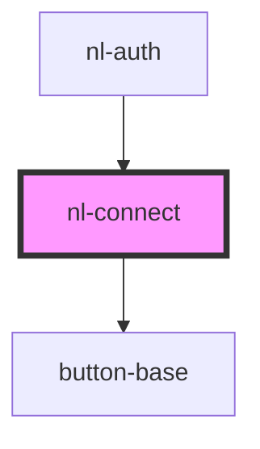

# nl-connect

<!-- Auto Generated Below -->

## Properties

| Property                   | Attribute       | Description | Type                 | Default                  |
| -------------------------- | --------------- | ----------- | -------------------- | ------------------------ |
| `authMethods`              | --              |             | `AuthMethod[]`       | `[]`                     |
| `connectionStringServices` | --              |             | `ConnectionString[]` | `[]`                     |
| `hasOTP`                   | `has-o-t-p`     |             | `boolean`            | `false`                  |
| `titleWelcome`             | `title-welcome` |             | `string`             | `'Connect to key store'` |

## Events

| Event            | Description | Type                  |
| ---------------- | ----------- | --------------------- |
| `nlNostrConnect` |             | `CustomEvent<string>` |

## Dependencies

### Used by

 - [nl-auth](../nl-auth)

### Depends on

- [button-base](../button-base)

### Graph

----------------------------------------------

*Built with [StencilJS](https://stenciljs.com/)*
