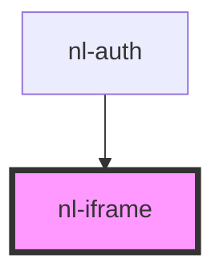

# nl-iframe

<!-- Auto Generated Below -->

## Properties

| Property      | Attribute     | Description | Type     | Default                                                                                                                         |
| ------------- | ------------- | ----------- | -------- | ------------------------------------------------------------------------------------------------------------------------------- |
| `description` | `description` |             | `string` | `'Your profile keys are stored in this browser tab and will be deleted if you log out, and your profile will be inaccessible.'` |
| `iframeUrl`   | `iframe-url`  |             | `string` | `''`                                                                                                                            |
| `titleModal`  | `title-modal` |             | `string` | `'Confirm'`                                                                                                                     |

## Events

| Event          | Description | Type               |
| -------------- | ----------- | ------------------ |
| `nlCloseModal` |             | `CustomEvent<any>` |

## Dependencies

### Used by

 - [nl-auth](../nl-auth)

### Graph

----------------------------------------------

*Built with [StencilJS](https://stenciljs.com/)*
