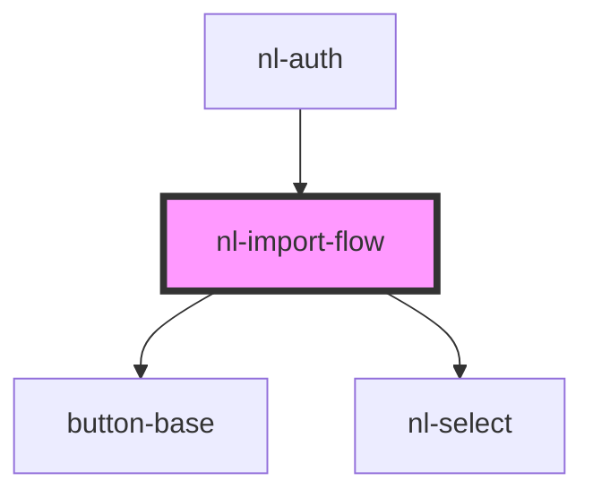

# nl-import-flow

<!-- Auto Generated Below -->

## Properties

| Property      | Attribute      | Description | Type                 | Default               |
| ------------- | -------------- | ----------- | -------------------- | --------------------- |
| `services`    | --             |             | `ConnectionString[]` | `[]`                  |
| `titleImport` | `title-import` |             | `string`             | `'Choose a service'`  |
| `titleInfo`   | `title-info`   |             | `string`             | `'Back up your keys'` |

## Events

| Event             | Description | Type                            |
| ----------------- | ----------- | ------------------------------- |
| `nlExportKeys`    |             | `CustomEvent<void>`             |
| `nlImportAccount` |             | `CustomEvent<ConnectionString>` |

## Dependencies

### Used by

 - [nl-auth](../nl-auth)

### Depends on

- [button-base](../button-base)
- [nl-select](../nl-select)

### Graph

----------------------------------------------

*Built with [StencilJS](https://stenciljs.com/)*
