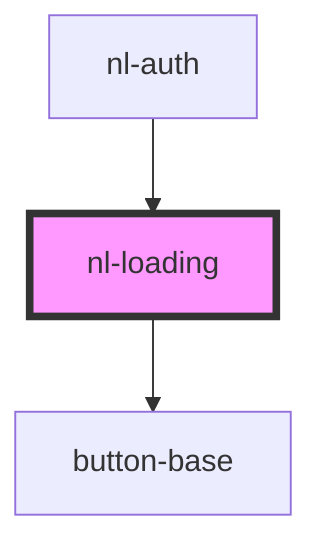

# nl-loading

<!-- Auto Generated Below -->

## Properties

| Property | Attribute | Description | Type     | Default     |
| -------- | --------- | ----------- | -------- | ----------- |
| `path`   | `path`    |             | `string` | `undefined` |

## Events

| Event              | Description | Type                   |
| ------------------ | ----------- | ---------------------- |
| `handleContinue`   |             | `CustomEvent<boolean>` |
| `stopFetchHandler` |             | `CustomEvent<boolean>` |

## Dependencies

### Used by

 - [nl-auth](../nl-auth)

### Depends on

- [button-base](../button-base)

### Graph

----------------------------------------------

*Built with [StencilJS](https://stenciljs.com/)*
