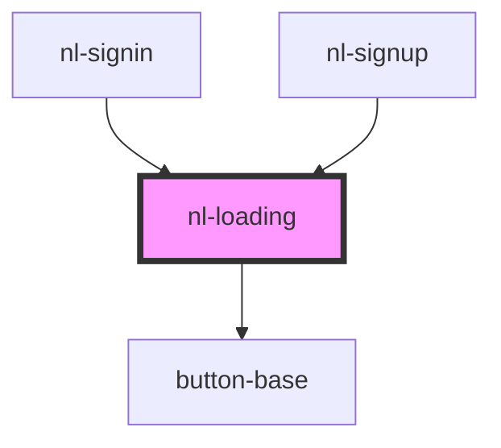

# nl-loading

<!-- Auto Generated Below -->

## Events

| Event              | Description | Type                   |
| ------------------ | ----------- | ---------------------- |
| `stopFetchHandler` |             | `CustomEvent<boolean>` |

## Dependencies

### Used by

 - [nl-signin](../nl-signin)
 - [nl-signup](../nl-signup)

### Depends on

- [button-base](../button-base)

### Graph

----------------------------------------------

*Built with [StencilJS](https://stenciljs.com/)*
