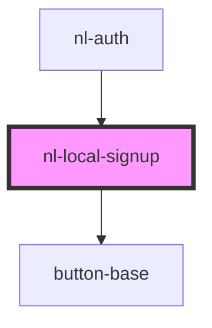

# nl-local-signup

<!-- Auto Generated Below -->

## Properties

| Property      | Attribute      | Description | Type     | Default                                               |
| ------------- | -------------- | ----------- | -------- | ----------------------------------------------------- |
| `description` | `description`  |             | `string` | `'You can use any nickname and can change it later.'` |
| `titleSignup` | `title-signup` |             | `string` | `'We only need your name'`                            |

## Events

| Event           | Description | Type                   |
| --------------- | ----------- | ---------------------- |
| `fetchHandler`  |             | `CustomEvent<boolean>` |
| `nlLocalSignup` |             | `CustomEvent<string>`  |

## Dependencies

### Used by

 - [nl-auth](../nl-auth)

### Depends on

- [button-base](../button-base)

### Graph

----------------------------------------------

*Built with [StencilJS](https://stenciljs.com/)*
