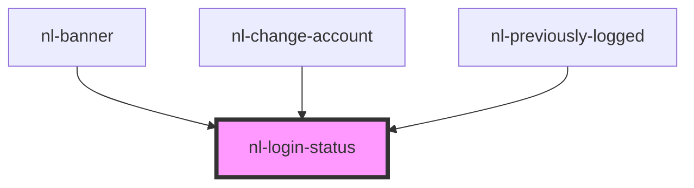

# nl-login-status

<!-- Auto Generated Below -->

## Properties

| Property | Attribute | Description | Type                                                                                                                                                              | Default     |
| -------- | --------- | ----------- | ----------------------------------------------------------------------------------------------------------------------------------------------------------------- | ----------- |
| `info`   | --        |             | `Info \| { name?: string; picture?: string; nip05?: string; pubkey: string; bunkerUrl?: string; authMethod: "local" \| "readOnly" \| "extension" \| "connect"; }` | `undefined` |

## Dependencies

### Used by

 - [nl-banner](../nl-banner)
 - [nl-change-account](../nl-change-account)
 - [nl-previously-logged](../nl-previously-logged)

### Graph

----------------------------------------------

*Built with [StencilJS](https://stenciljs.com/)*
