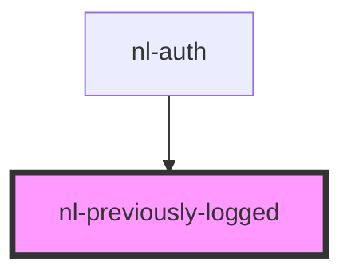

# nl-previously-logged

<!-- Auto Generated Below -->

## Properties

| Property      | Attribute     | Description | Type     | Default                                                                             |
| ------------- | ------------- | ----------- | -------- | ----------------------------------------------------------------------------------- |
| `description` | `description` |             | `string` | `'You can switch between active accounts or use them under pre-existing accounts.'` |
| `titlePage`   | `title-page`  |             | `string` | `'Previously logged'`                                                               |

## Events

| Event                  | Description | Type                  |
| ---------------------- | ----------- | --------------------- |
| `nlLoginRecentAccount` |             | `CustomEvent<string>` |
| `nlSwitchAccount`      |             | `CustomEvent<string>` |

## Dependencies

### Used by

 - [nl-auth](../nl-auth)

### Graph

----------------------------------------------

*Built with [StencilJS](https://stenciljs.com/)*
