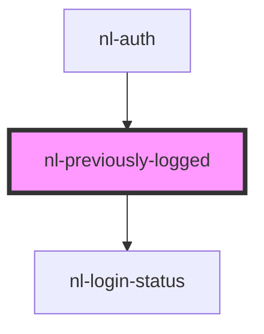

# nl-previously-logged

<!-- Auto Generated Below -->

## Properties

| Property      | Attribute     | Description | Type     | Default                                                                   |
| ------------- | ------------- | ----------- | -------- | ------------------------------------------------------------------------- |
| `description` | `description` |             | `string` | `'Switch between active accounts or choose a recent one for fast login.'` |
| `titlePage`   | `title-page`  |             | `string` | `'Your accounts'`                                                         |

## Events

| Event                  | Description | Type                                                                                                                                                                      |
| ---------------------- | ----------- | ------------------------------------------------------------------------------------------------------------------------------------------------------------------------- |
| `nlLoginRecentAccount` |             | `CustomEvent<{ name?: string; picture?: string; readonly?: boolean; extension?: boolean; nip05?: string; pubkey: string; bunkerUrl?: string; typeAuthMethod?: string; }>` |
| `nlSwitchAccount`      |             | `CustomEvent<Info>`                                                                                                                                                       |

## Dependencies

### Used by

 - [nl-auth](../nl-auth)

### Depends on

- [nl-login-status](../nl-login-status)

### Graph

----------------------------------------------

*Built with [StencilJS](https://stenciljs.com/)*
