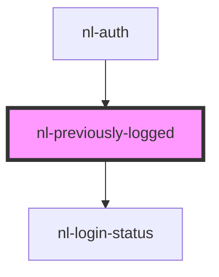

# nl-previously-logged

<!-- Auto Generated Below -->

## Properties

| Property      | Attribute     | Description | Type           | Default                                                                   |
| ------------- | ------------- | ----------- | -------------- | ------------------------------------------------------------------------- |
| `accounts`    | --            |             | `Info[]`       | `[]`                                                                      |
| `description` | `description` |             | `string`       | `'Switch between active profiles or choose a recent one for fast login.'` |
| `recents`     | --            |             | `RecentType[]` | `[]`                                                                      |
| `titlePage`   | `title-page`  |             | `string`       | `'Your profiles'`                                                         |

## Events

| Event                  | Description | Type                                                                                                                                             |
| ---------------------- | ----------- | ------------------------------------------------------------------------------------------------------------------------------------------------ |
| `nlLoginRecentAccount` |             | `CustomEvent<{ name?: string; picture?: string; nip05?: string; pubkey: string; bunkerUrl?: string; authMethod: AuthMethod; domain?: string; }>` |
| `nlRemoveRecent`       |             | `CustomEvent<{ name?: string; picture?: string; nip05?: string; pubkey: string; bunkerUrl?: string; authMethod: AuthMethod; domain?: string; }>` |
| `nlSwitchAccount`      |             | `CustomEvent<Info>`                                                                                                                              |

## Dependencies

### Used by

 - [nl-auth](../nl-auth)

### Depends on

- [nl-login-status](../nl-login-status)

### Graph

----------------------------------------------

*Built with [StencilJS](https://stenciljs.com/)*
