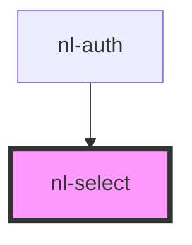

# nl-select

<!-- Auto Generated Below -->

## Properties

| Property   | Attribute   | Description | Type                                             | Default     |
| ---------- | ----------- | ----------- | ------------------------------------------------ | ----------- |
| `darkMode` | `dark-mode` |             | `boolean`                                        | `false`     |
| `options`  | --          |             | `OptionType[]`                                   | `undefined` |
| `selected` | `selected`  |             | `number`                                         | `undefined` |
| `theme`    | `theme`     |             | `"default" \| "lemonade" \| "ocean" \| "purple"` | `'default'` |

## Events

| Event          | Description | Type                  |
| -------------- | ----------- | --------------------- |
| `selectDomain` |             | `CustomEvent<string>` |

## Dependencies

### Used by

 - [nl-auth](../nl-auth)

### Graph

----------------------------------------------

*Built with [StencilJS](https://stenciljs.com/)*
