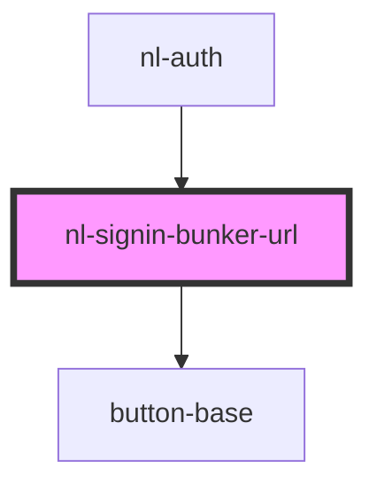

# nl-signin-bunker-url

<!-- Auto Generated Below -->

## Properties

| Property      | Attribute     | Description | Type     | Default                           |
| ------------- | ------------- | ----------- | -------- | --------------------------------- |
| `description` | `description` |             | `string` | `'Please enter your bunker url.'` |
| `titleLogin`  | `title-login` |             | `string` | `'Log in with bunker url'`        |

## Events

| Event          | Description | Type                  |
| -------------- | ----------- | --------------------- |
| `nlCheckLogin` |             | `CustomEvent<string>` |
| `nlLogin`      |             | `CustomEvent<string>` |

## Dependencies

### Used by

 - [nl-auth](../nl-auth)

### Depends on

- [button-base](../button-base)

### Graph

----------------------------------------------

*Built with [StencilJS](https://stenciljs.com/)*
