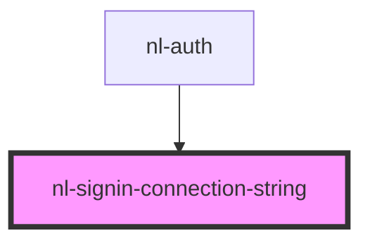

# nl-signin-connection-string

<!-- Auto Generated Below -->

## Properties

| Property           | Attribute           | Description | Type     | Default                                                   |
| ------------------ | ------------------- | ----------- | -------- | --------------------------------------------------------- |
| `connectionString` | `connection-string` |             | `string` | `''`                                                      |
| `description`      | `description`       |             | `string` | `'Scan or copy the connection string with key store app'` |
| `titleLogin`       | `title-login`       |             | `string` | `'Connection string'`                                     |

## Dependencies

### Used by

 - [nl-auth](../nl-auth)

### Graph

----------------------------------------------

*Built with [StencilJS](https://stenciljs.com/)*
