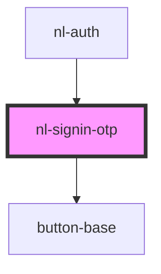

# nl-signin-otp

<!-- Auto Generated Below -->

## Properties

| Property         | Attribute           | Description | Type     | Default                                                                                              |
| ---------------- | ------------------- | ----------- | -------- | ---------------------------------------------------------------------------------------------------- |
| `description`    | `description`       |             | `string` | `'Please enter your user name or npub, and we will send you a direct message with a one-time code.'` |
| `descriptionOTP` | `description-o-t-p` |             | `string` | `'Please enter the one-time code we sent to you as a direct message on Nostr.'`                      |
| `titleLogin`     | `title-login`       |             | `string` | `'Log in with DM'`                                                                                   |
| `titleLoginOTP`  | `title-login-o-t-p` |             | `string` | `'Enter the code'`                                                                                   |

## Events

| Event            | Description | Type                  |
| ---------------- | ----------- | --------------------- |
| `nlCheckLogin`   |             | `CustomEvent<string>` |
| `nlLoginOTPCode` |             | `CustomEvent<string>` |
| `nlLoginOTPUser` |             | `CustomEvent<string>` |

## Dependencies

### Used by

 - [nl-auth](../nl-auth)

### Depends on

- [button-base](../button-base)

### Graph

----------------------------------------------

*Built with [StencilJS](https://stenciljs.com/)*
