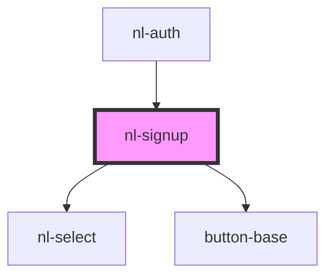

# nl-signup

<!-- Auto Generated Below -->

## Properties

| Property      | Attribute      | Description | Type     | Default                                           |
| ------------- | -------------- | ----------- | -------- | ------------------------------------------------- |
| `bunkers`     | `bunkers`      |             | `string` | `'nsec.app,highlighter.com'`                      |
| `description` | `description`  |             | `string` | `'Choose some username and a key store service.'` |
| `titleSignup` | `title-signup` |             | `string` | `'Create keys with key store'`                    |

## Events

| Event           | Description | Type                   |
| --------------- | ----------- | ---------------------- |
| `fetchHandler`  |             | `CustomEvent<boolean>` |
| `nlCheckSignup` |             | `CustomEvent<string>`  |
| `nlSignup`      |             | `CustomEvent<string>`  |

## Dependencies

### Used by

 - [nl-auth](../nl-auth)

### Depends on

- [nl-select](../nl-select)
- [button-base](../button-base)

### Graph

----------------------------------------------

*Built with [StencilJS](https://stenciljs.com/)*
