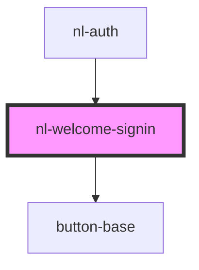

# nl-welcome-signin

<!-- Auto Generated Below -->

## Properties

| Property       | Attribute       | Description | Type           | Default    |
| -------------- | --------------- | ----------- | -------------- | ---------- |
| `authMethods`  | --              |             | `AuthMethod[]` | `[]`       |
| `hasExtension` | `has-extension` |             | `boolean`      | `false`    |
| `hasOTP`       | `has-o-t-p`     |             | `boolean`      | `false`    |
| `titleWelcome` | `title-welcome` |             | `string`       | `'Log in'` |

## Events

| Event              | Description | Type                |
| ------------------ | ----------- | ------------------- |
| `nlLoginExtension` |             | `CustomEvent<void>` |

## Dependencies

### Used by

 - [nl-auth](../nl-auth)

### Depends on

- [button-base](../button-base)

### Graph

----------------------------------------------

*Built with [StencilJS](https://stenciljs.com/)*
