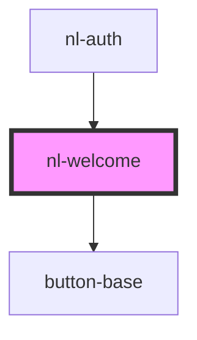

# nl-welcome

<!-- Auto Generated Below -->

## Properties

| Property                | Attribute                   | Description | Type      | Default                                                                                        |
| ----------------------- | --------------------------- | ----------- | --------- | ---------------------------------------------------------------------------------------------- |
| `description`           | `description`               |             | `string`  | `'This app is part of the Nostr network. Log in with your Nostr account or join the network.'` |
| `isSignInWithExtension` | `is-sign-in-with-extension` |             | `boolean` | `true`                                                                                         |
| `titleWelcome`          | `title-welcome`             |             | `string`  | `'Welcome!'`                                                                                   |

## Events

| Event          | Description | Type                |
| -------------- | ----------- | ------------------- |
| `changeScreen` |             | `CustomEvent<void>` |

## Dependencies

### Used by

 - [nl-auth](../nl-auth)

### Depends on

- [button-base](../button-base)

### Graph

----------------------------------------------

*Built with [StencilJS](https://stenciljs.com/)*
